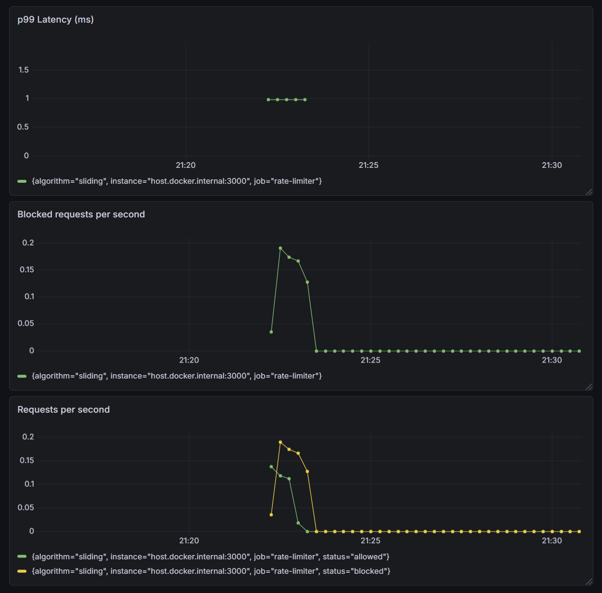

# 🚀 Distributed Rate Limiter as a Service

A production-grade distributed rate limiting service built from scratch using **Node.js**, **Redis**, and **PostgreSQL** — with full **Prometheus + Grafana** observability.

> Built to understand how real-world rate limiting works under the hood — no external rate limiting libraries used.



---

## 📦 Tech Stack

| Layer | Technology |
|---|---|
| **API Server** | Node.js + Express |
| **Rate Limit Store** | Redis (with Lua scripts for atomicity) |
| **Persistence** | PostgreSQL (rules + audit logs) |
| **Monitoring** | Prometheus + Grafana |
| **Containerization** | Docker Compose |
| **Logging** | Winston (structured JSON) |

---

## 🧠 Rate Limiting Algorithms

Three algorithms are implemented from scratch. Each one solves a different problem.

### 1. Fixed Window

Simplest implementation — one Redis counter per user per endpoint. Resets at fixed clock boundaries (every 60 seconds).

**The problem:** boundary bursting. A user can fire 100 requests at `11:00:58` and another 100 at `11:01:02`. Both land in separate windows, so both are allowed — effectively doubling the intended limit.

**When to use:** situations where simplicity matters more than perfect accuracy. Internal health checks, low-risk endpoints, anything where occasional bursts won't cause real damage.

### 2. Sliding Window Log

Tracks the exact timestamp of every request in a Redis sorted set. The window always covers the last *N* seconds from the current moment — no fixed boundary.

This eliminates the boundary burst problem entirely. The window slides with time, so there's no seam to exploit.

**The cost:** memory. Every request timestamp is stored individually instead of a single counter. At high traffic this adds up.

**Atomicity:** all Redis operations (prune old entries → count → insert) run inside a single Lua script. Two simultaneous requests can't both read the same count and both squeeze through.

**When to use:** endpoints where fair, accurate limiting matters. Search APIs, public-facing routes, anything where a burst could degrade the experience for other users.

### 3. Token Bucket

Stores two values per user — current token count and last refill time. Tokens refill at a constant rate. Each request costs one token.

The key difference: idle users accumulate tokens. Someone who hasn't hit the API in five minutes has a full bucket and can legitimately burst. This matches how real traffic works — APIs get hit in batches, not at perfectly even intervals.

**The math:**
```
newTokens = timePassed × refillRate
currentTokens = min(previousTokens + newTokens, capacity)
```

**When to use:** endpoints where occasional bursting is expected and acceptable. Data export endpoints, batch operations, anything where users naturally send requests in clusters.

### Quick Comparison

| | Fixed Window | Sliding Window | Token Bucket |
|---|---|---|---|
| **Memory** | Very low (1 counter) | Higher (1 entry per request) | Low (2 values) |
| **Burst handling** | Poor (boundary exploit) | Strict (no bursting) | Good (controlled bursting) |
| **Accuracy** | Approximate | Exact | Smooth average |
| **Complexity** | Trivial | Needs Lua for atomicity | Moderate |
| **Redis structure** | `String` (INCR) | `Sorted Set` (ZADD/ZCARD) | `Hash` (HSET/HGET) |

---

## 📊 Observability

The service exposes Prometheus metrics at `GET /api/metrics` and includes a Grafana dashboard for real-time monitoring.

**Custom Metrics:**

| Metric | Type | Description |
|---|---|---|
| `rate_limiter_requests_total` | Counter | Total requests, labelled by `algorithm` and `status` |
| `rate_limiter_blocked_total` | Counter | Blocked requests, labelled by `algorithm` |
| `rate_limiter_latency_ms` | Histogram | Latency of rate limit checks (ms) |
| `rate_limiter_active_keys` | Gauge | Number of active rate limit keys |

Default Node.js metrics (event loop lag, GC, memory) are also collected automatically.

---

## 🛠️ Setup & Installation

### Prerequisites

- Node.js (v18+)
- Docker & Docker Compose
- PostgreSQL database

### 1. Clone the repo

```bash
git clone https://github.com/luvkushsaini/distributed-rate-limiter.git
cd distributed-rate-limiter
```

### 2. Install dependencies

```bash
npm install
```

### 3. Configure environment

```bash
cp .env.example .env
# Edit .env with your PostgreSQL and Redis credentials
```

### 4. Run database migrations

```bash
npm run migrate
```

### 5. Start infrastructure (Redis + Prometheus + Grafana)

```bash
docker-compose up -d
```

### 6. Start the app

```bash
npm run dev
```

The app runs on `http://localhost:3000`.

---

## 🔗 API Endpoints

| Method | Endpoint | Description |
|---|---|---|
| `POST` | `/api/check` | Check rate limit for an identifier |
| `GET` | `/api/rules` | Get all rate limit rules |
| `POST` | `/api/rules` | Create a new rate limit rule |
| `GET` | `/api/health` | Health check (Redis status) |
| `GET` | `/api/metrics` | Prometheus metrics endpoint |

### Example: Check rate limit

```bash
curl -X POST http://localhost:3000/api/check \
  -H "Content-Type: application/json" \
  -d '{
    "identifier": "user_123",
    "algorithm": "sliding",
    "limit": 100,
    "windowMs": 60000
  }'
```

**Response:**
```json
{
  "allowed": true,
  "remaining": 99,
  "limit": 100,
  "windowSeconds": 60,
  "resetAt": 1709567400,
  "algorithm": "sliding-window"
}
```

---

## 🐳 Docker Services

| Service | Port | Description |
|---|---|---|
| Redis | `6379` | Rate limit data store |
| Prometheus | `9090` | Metrics collection & querying |
| Grafana | `3001` | Dashboards & visualization (login: `admin`/`admin`) |

> **Note:** The Node.js app runs locally with `npm run dev`, not inside Docker.

---

## 🧪 Testing

```bash
# Run all tests with coverage
npm test

# Run tests in watch mode
npx jest --watch
```

---

## 📁 Project Structure

```
src/
├── algorithms/       # Rate limiting algorithms (fixed, sliding, token bucket)
├── config/           # App and rate limit configuration
├── db/               # PostgreSQL connection and migrations
├── metrics/          # Prometheus metrics module
├── middleware/        # Rate limiting Express middleware
├── routes/           # API route handlers
├── store/            # Redis client and connection
├── utils/            # Logger (Winston)
└── index.js          # App entry point
```

---

## 📝 License

This project is built for learning purposes.
